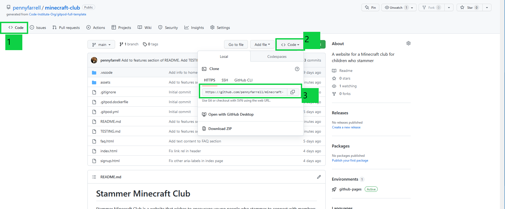

# Stammer Minecraft Club

Stammer Minecraft Club is a website that wishes to encourage young people who stammer to connect with members of the stammering community through gaming. 

The site will be targeted at young people who stammer who feel isolated or are experiencing social stigma about stammering. The site is also aimed at their parents/guardians who may be researching the club for their child/teenager. 

The website will cover information about the club ethos which promotes authenticity and a 'free-to-stammer' philosophy. The site will provide details of the club groups which are organised by age and a sign up form to register for the club. 

The site will have a high visual content with images and a video of designs created by current club members to demonstrate the wonderful creations that the club members built and portray a positive impression of creativity and fun within the club sessions.  

<a href="https://pennyfarrell.github.io/minecraft-club/" target="_blank" rel="noopener">Stammer Out Loud and Build!</a>

## Features

### Existing Features

- _Navigation Bar_

- Featured on all three pages, the fully responsive navigation bar includes links to the Home page, FAQ and Sign Up page. The navigation bar is identical on each page to allow for easy navigation.
  - This section will allow the user to easily navigate from page to page across all devices without having to revert back to the previous page via the ‘back’ button. 

# Contents

* [**User Experience**](#user-experience)
    * [Wireframes](#wireframes)
    * [Site Structure](#site-structure)
    * [Design Choices](#design-choices)
    *  [Typography](#typography)
    *  [Color Scheme](#color-scheme)
* [**Features**](#features)
    * [**Home Page**](#home-page)
         * [Navigation menu](#navigation-menu)
         * [Hero Image](#hero-image)
         * [Testimonial Quotes Section](#quotes-section)
         * [Images](#images)
         * [Video](#video)
         * [Footer](#footer)
    * [**FAQ Page**](#faq-page)
         * [Groups and Age Categories](#groups)
         * [Club Timetable](#timetable-section)
    * [**Sign Up Page**](#signup-page)
         * [Sign Up Form](#signup-form)
        * [**Future Features**](<#future-features>)
* [**Technologies Used**](<#technologies-used>)
* [**Testing**](<#testing>)
* [**Deployment**](<#deployment>)
* [**Credits**](<#credits>)
    * [**Content**](<#content>)
    * [**Media**](<#media>)
*  [**Acknowledgements**](<#acknowledgements>)  

# User Experience

## Wireframes

![Mobile wireframe page 1 - top]assets/readme-images/wireframe-mobile-top.PNG

![Mobile wireframe page 1 - top]assets/readme-images/wireframe-mobile-bottom.PNG

The wireframes were created on paper to sketch out ideas and then narrowed down to a first design in [Balsamiq](https://balsamiq.com). 

Originally, I designed desktop first but after advice from my tutor, I changed to coding mobile-first. I then created a new wireframe for mobiles. This approach later led to simpler media queries. 

I originally had the timetable on page two with a gallery but I moved the timetable with the age groups to the home page so that it was very clear who the target audience for the club is. As there is a lot of content on the home page, I added a 'back-to-top' button to make it easier for the user to navigate back to the nav bar. 

I added an FAQ page to my second page with questions and answers directed at both parents/guardians as well as young people, to reflect the different needs of each user type.

I left out the gallery because I decide to incorporate the images throughout the website to weave the visuals across the whole site instead of grouping them in one place.The intention was to give the whole site a sense of fun to appeal to young people, and to immerse the user in a Minecraft-like environment throughout the site. 

[Back to top](#contents)

## Site Structure

Stammer Minecraft Club has three pages. All pages can be easily accessed through the navigation menu in the header section. The [Landing page](index.html), the [FAQ](faq.html) page and finally the [Sign Up](signup.html) page.

[Back to top](#contents)

## Design Choices

 * ### Typography
      The chosen fonts were downloaded from [Google Fonts](https://fonts.google.com/). "Barlow", weight Regular 400 and Medium 500 is used for the headings. "Fira Sans Extra Condensed", weight 400, is used for the quotations. Both fonts are fun and playful yet easily legible.

 * ### Color Scheme
      The chosen color scheme reflects the colors used in Minecraft Bedrock and are the colours most often used for earth blocks. The light font was selected for contrast against the dark green and dark brown. The colours were picked from Minecraft images using Canva. The shades and contrasts were compared and selected for optimum contrast using [WebAIM (Web Accessibility In Mind)](https://webaim.org/resources/contrastchecker/).

[Back to top](#contents)

# Features

Stammer Minecraft Club is meant to be fun, playful and welcoming with appeal to both young people and their parents/guardians. The Navigation bar makes finding the necessary information simple and the layout is responsive. All hypertext links open in a new page. The sign up form invites the parents/guardians to sign up to the relevant group. 

## Logo and Matching Favicon

The logo is placed alongside the page header which is visible on each page. The image selected was a creeper face which is strongly associated with Minecraft and worked well as a small image. Alternative images associated with Minecraft would not have scaled down well, so character skins or Mobs were not used. There are two facial expressions of creeper heads (sad or smiling) so the smiling version was used to indicate that this is a fun game and promote the expectation of a positive experience. For continuity, the logo was also converted to a Favicon. 

## Home Page

The Home Page has information and testimonials which illustrate the experience of club members to give first-hand descriptions of the real experience of being a club member. There are images showing the creations built in Minecraft during club sessions. There is a video narrated by a club member who stammers which aims to reassure potential new members that it really is ok to stammer in the club and to hear the voice of a real member. There is a description of the club groups which shows the age range that can attend and the schedule of sessions. The images are positioned to slightly reveal the next image and entice the user to scroll down the entire page.

### Navigation Menu

* Navigation Bar is present on all three pages to make navigation of the website easy and quick. It contains links to Home, FAQ and Sign Up pages. Its design is consistent and identical on all of the pages. This feature enables the users to navigate from page to page without having to use the "back" button of the browser.

* The main logo is also clickable and takes the user back to the home page.

[Back to top](#contents)

### Hero Image

The landing page includes a large dynamic image from the Minecraft world which slowly zooms in. The image showing a colourful, mystical mushroom village which catches the eye of the user and invites them to remain on the page.

[Back to top](#contents)

### Reasons Section

This section introduces three reasons for joining the club represented by testimonials from existing members (peers of potential club members). The aim is to get new members interested in joining the club and to convey the value of gaming with other young people who stammer by their peers. The quotes help make the information relevant and relatable to young people visiting the website and demonstrates the value of the club to prospective parents/guardians. A contrast issue with the image titles used in this section was flagged by WAVE and subsequently fixed (see  [_file_](TESTING.md) for more details).
[Back to top](#contents)

### Video

There is a video embedded on the home page with showing some of the Minecraft creations built by club members and narrated by a young person who stammers. This would encourage potential members to have an understanding of what to expect about the club and to feel reassured that stammering is ok (and welcomed!) in the club.  

[Back to top](#contents)

### Club Timetable Section

The purpose of this section is to succinctly show the age groups and times for each club session. The timetable is responsive on different device sizes to maximize visibility and help potential members easily access the structure of the groups (organised by age) and then identify the relevant time for that session. 

[Back to top](#contents)

### FAQ Section

The main purpose of this section is to answer questions that either parents/guardians may have as well as young people themselves.
An accordion style question-and-answer format was used to make the page look less busy, especially on smaller screens. The Font-awesome icons were used to differentiate the adult-young people sections. Colour contrasts were used to differentiate questions from answers. 

[Back to top](#contents)

### Footer

The Footer section is consistent in design on all pages. It includes a clickable envelope icon which opens an email form on a blank page to make it easy to get connected by email. The Phone icon is clickable to easily connect a call to the club contact person. There are also links to social media pages including Facebook, Instagram and Twitter. All the social media links open in a new tab. There is a 'back to top' button so that site users can easily navigate back to the top menu and nav bar.

[Back to top](#contents)

### Sign Up Page

A sign up form is available for those who would like to express an interest in joining the club. There are options to select the relevant group so that the appropriate information is provided to the new member. There is a repeated timetable below the form so that site users can access the information again without having to navigate away from the page. All elements, such as parent/guardian name, young person's name, email address etc. are required. 

[Back to top](#contents)

### Future Features 

* I would add an additional page with a gallery to showcase more images of the creations made by the group. 
* I would add an information section about the organisation and club leaders. However, as this is a not a real organisation, I decided to focus on other features for the purposes of the assignment. 
* I would add JavaScript to automate an email being sent to the group organiser after a user filled out the signup form. 

[Back to top](#contents)

# Technologies Used

* [HTML5](https://html.spec.whatwg.org/) - provided the structure and content for the website
* [CSS](https://www.w3.org/Style/CSS/Overview.en.html) - enabled applying own styles and design
* [Balsamiq](https://balsamiq.com/wireframes/) - used for creating the wireframes
* [Gitpod](https://www.gitpod.io/#get-started) - used for deploying the website
* [Github](https://github.com/) - used for hosting and editing the website

[Back to top](#contents)

# Testing

For detailed results of all the tests conducted, please refer to this [_file_](TESTING.md).

[Back to top](#contents)

# Deployment

## **Project Deployment**

The site was deployed to GitHub pages. In order to deploy, the following steps were taken:
  1. Navigate to the **Settings** tab in the GitHub repository.
  2. When in **Settings**, navigate to the **Pages** tab below the middle of the list on the left hand side.
  3. From the **Branch** drop-down menu select the option **main**, then click **save**.
  4. After the main branch has been selected and confirmed, the page will be automatically refreshed. The refresh might take several minutes. A detailed message will appear at the top of the page indicating the successful deployment. The message will include a link to the deployed site.

The link to the the live site can be found here - https://pennyfarrell.github.io/minecraft-club/

[Back to top](#contents)  

## **To fork the repository on GitHub**
A copy of the GitHub Repository can be made by forking the GitHub account. This copy can be viewed and changed without affecting the original repository. Take the following steps to fork the repository:

1. Log in to **GitHub** and locate the [repository](https://github.com/pennyfarrell/minecraft-club).
2. On the top right hand side of the page is a button called **'Fork'**. Click on the button to create a copy of the original repository in your GitHub Account.

[Back to top](#contents)

## **To create a local clone of a project**
Take the following steps to create a clone of a project:

1. Click on the **Code** button in the left top corner.
2. Next to the green **GitPod** button, click on **Code** drop-down menu. 
2. In the **HTTPS** section, click on the clipboard icon to copy the displayed URL.
3. In your IDE of choice, open **Git Bash**.
4. Change the current working directory to the location where you want the cloned directory to be made.
5. Type **git clone**, and then paste the URL copied from GitHub.
6. Press **enter** and the local clone will be created.

[Back to top](#contents)

# Credits

## Content

* The overall inspiration came from a voluntary club that I run. The real version of the club is a single session but I would love the concept of the club expanding to include members of more age-groups. The FAQ section came from real questions that I have been asked over the past year since I started the club. I now run another version of this club with the [Irish Stammering Association] (https://stammeringireland.ie/). The aims of the club are to create a community for young people who stammer in Ireland and to advocate on their behalf to challenge myths and stigma about stammering. The expectation to 'overcome' stammering is pervasive but negative. Stammering is a valid way of speaking and the young stammering community need encouragement to have their voices heard just as they are, without the expectation of having to be fluent.
* [Balsamiq](https://balsamiq.com/wireframes/) was used to create the wireframes.
* The inspiration for the hero image with zoom styling, the navigation bar, footer and sign up form came from *Love Running Project*.
* Additional learning came from W3 schools, in particular to learn Flex and CSS styling for the timetable, font, underline and alignment[W3schools](https://www.w3schools.com/css/default.asp).
* W3 school section on applying text to a hero image was also very useful [W3schools](https://www.w3schools.com/howto/howto_css_hero_image.asp).
* Further learning about HTML and CSS came from [GeeksForGeeks](https://www.geeksforgeeks.org/).
* The code for the speech bubble quotes was taken from code section by [Code Generator - Speech Bubble Generator](https://www.html-code-generator.com/css/speech-bubble-generator).
* The code for the accordion styling of the FAQ section was taken from a blog post by [Felix Dusengimana](https://dev.to/felixdusengimana/.lets-create-an-faq-section-with-html-and-css-only-detail-tag-explained-12gf) and the related [codepen.io](https://codepen.io/phelixdusengimana/pen/ExQNMME).
* The code for the back-to-top button was taken from [Atul Prajapati](https://dev.to/atulcodex/scroll-to-top-button-with-just-html-css-1c2).
* The fonts were downloaded from [Google Fonts](https://fonts.google.com/).
* The Favicon was created using [Favicon.io](https://favicon.io/favicon-converter/).
* The color palate was found using [Color Picker From Image](https://colorpickerfromimage.com/).
* The icons were found at [Font Awesome](https://fontawesome.com/).
* Further learning about using media queries came from Joy Shaheb at [FreeCodeCamp](https://www.freecodecamp.org/news/learn-css-media-queries-by-building-projects/).
* The contrast error for the home page testimonial image titles was resolved with a span suggestion, taken from a blog post by [Go Make Things](https://gomakethings.com/highlighting-effect-with-css/).
* The framework for the readme file was inspired by a layout from a cohort peer who had received a layout template from their mentor: [lucia2007](https://github.com/lucia2007/tennis-for-all) and [Kera Cudmore README Examples](https://github.com/kera-cudmore/readme-examples).
* Further learning about using Markdown was accessed from a cheatsheet written by [Adam Pritchard](https://github.com/adam-p/markdown-here/wiki/Markdown-Here-Cheatsheet).

## Media

* The Favicon and title logo were taken from [Fonticon](https://fonticon.github.io/fonticon/#/select).
* The logo was a Minecraft creeper with the image sourced from [Planet Minecraft](https://www.planetminecraft.com/server/smiling-creeper-266028/)
* The images were personal images from the club I run in real life.
* The video was an extract from a video I made for another advocacy project called "Here All Along" to highlight the need for more stammered speech to feature in mainstream media. * This project was recorded from the club I run and submitted to [ISAD.live 2022](https://isad.live/isad-2022/papers-presented-by/kids-corner/here-all-along-penny-farrell/).
* The photos were converted to webp files to reduce file size using the [Cloud Convert](https://cloudconvert.com/png-to-webp).
* The image and video files were reduced in size by [Free Convert](https://www.freeconvert.com/).

## Acknowledgements
* Extra help and guidance was received from my mentor Daisy McGirr, from CI tutors and fellow Code Institute students on Slack.  
* I received help from tutors with two issues I encountered. The first was in trying to get the header logo, title and nav bar to be responsive with a column menu on small screens and a row for larger screens. The second time was for a bug on my signup page which had a skewed alignment from one side when the screen size increased.  
* To help with planning and preparation of the assignment, I found the Code Institute library useful. the following were particularly helpful: [Milestone 1 Planning with Stephen Seagrave](https://youtu.be/06tXTbm-DxI) and [Creating your first README with Kera Cudmore](https://youtu.be/XbYJ4VlhSnY).
* I found [Kevin Powell's videos](https://www.youtube.com/watch?v=u044iM9xsWU) helpful in understanding and applying Flexbox along with playing several rounds of [Flexbox Froggy](http://flexboxfroggy.com/).

