# Testing

## Code Validation

The [Stammer Minecraft Club](https://pennyfarrell.github.io/minecraft-club/) webpage was thouroughly tested. HTML code was reviewed in the [W3C HTML Validator](https://validator.w3.org). The CSS code was validated in the [W3C CSS Validator](https://jigsaw.w3.org/css-validator/). There were a few minor errors found regarding incorrect semantic use of header tags, missing closing double quote in attribute and incorrect input labels. All mistakes were corrected and both HTML and CSS files currently have no errors.

The results of HTML validation of each of the pages are as follows:

* Home Page

  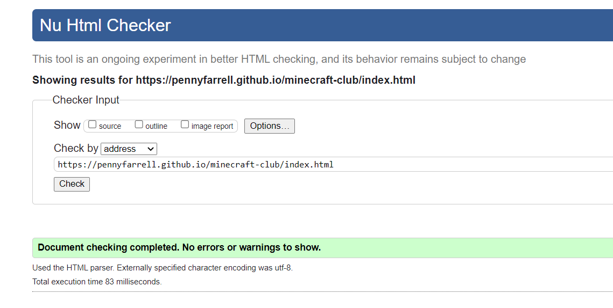

* FAQ Page

  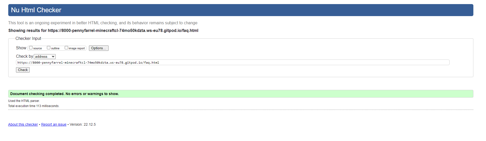

* Sign Up Page
  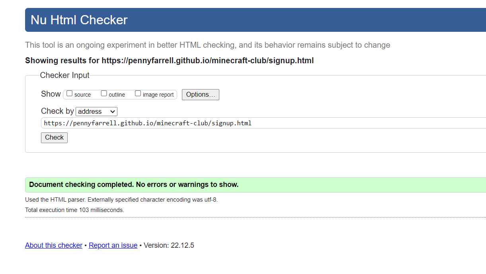

The CSS Validator results are below:

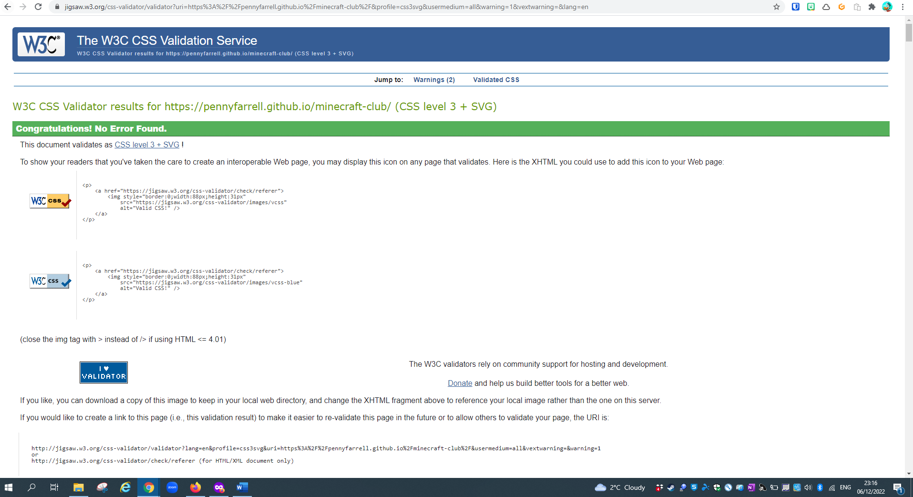

## Browser Compatibility

The website was tested on the following browsers: Google Chrome, Safari, Microsoft Edge and Mozilla Firefox. There were no errors discovered in the functionality of the site or the individual features.

## Responsiveness Test

Testing of responsive design was carried out manually by utilizing [Google Chrome DevTools](https://developer.chrome.com/docs/devtools) and [Responsive Design Checker](https://www.responsivedesignchecker.com/).

|        | S Galaxy 5 | iPhone 6/6S/7| iPhone 5 | iPad Mini | iPad Pro | Display <1200px | Display >1200px |
|--------|------------|--------------|----------|-----------|----------|-----------------|-----------------|
| Render | pass       | pass         | pass     | pass      | pass     | pass            | pass            |
| Images | pass       | pass         | pass     | pass      | pass     | pass            | pass            |
| Links  | pass       | pass         | pass     | pass      | pass     | pass            | pass            |

See screenshots of pages from different screen sizes to illustarte the responsive deisgn changes according to the screen size:

###iPhone 5

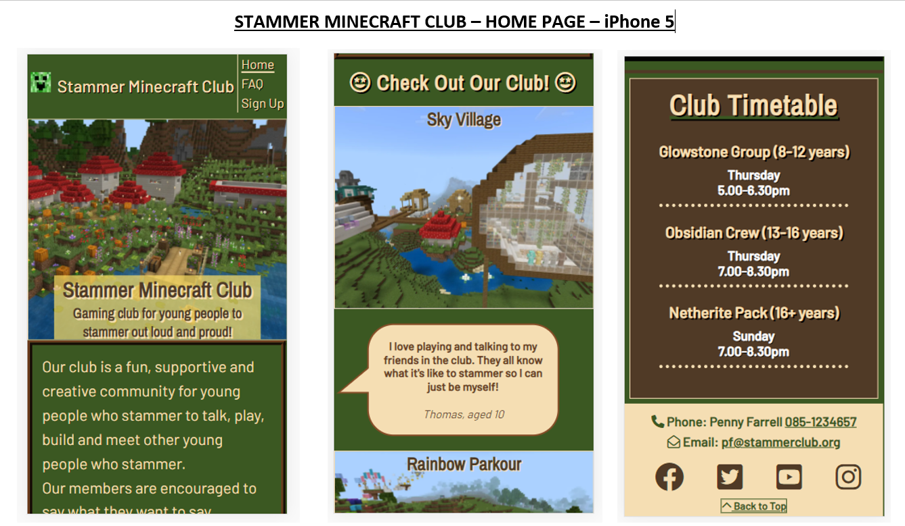

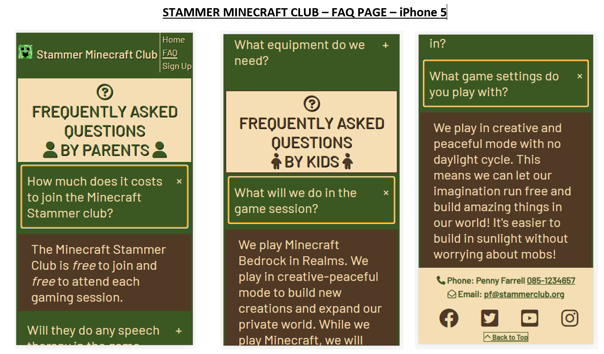

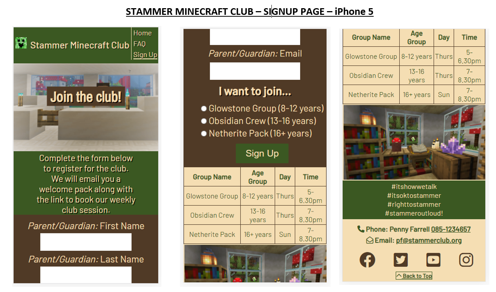

###iPad

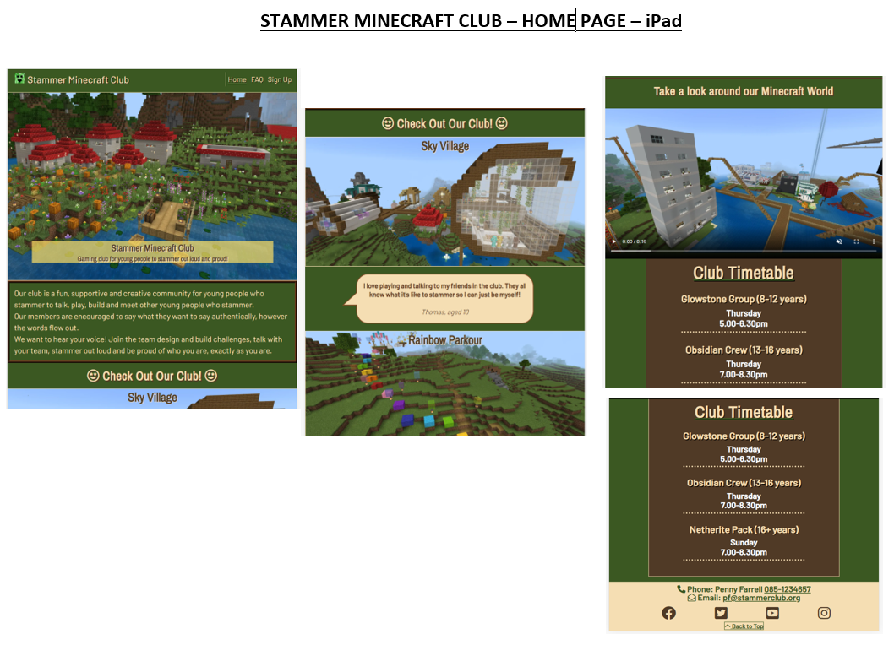

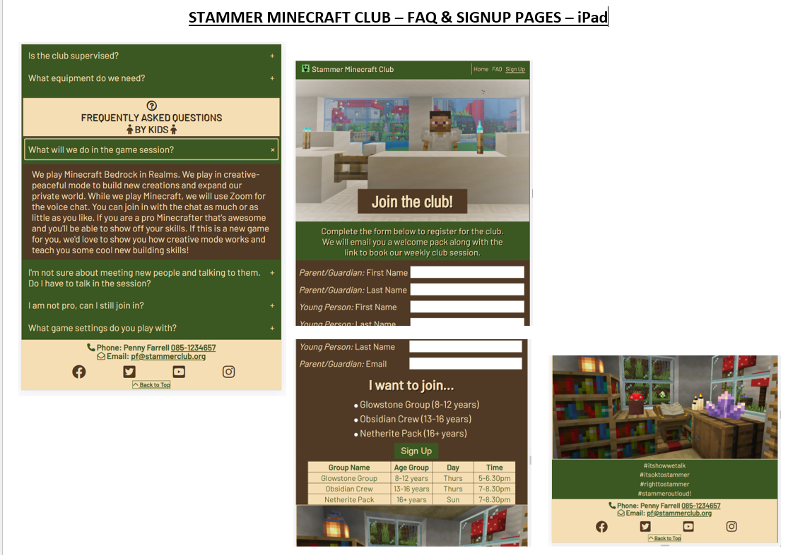

###iPad Pro

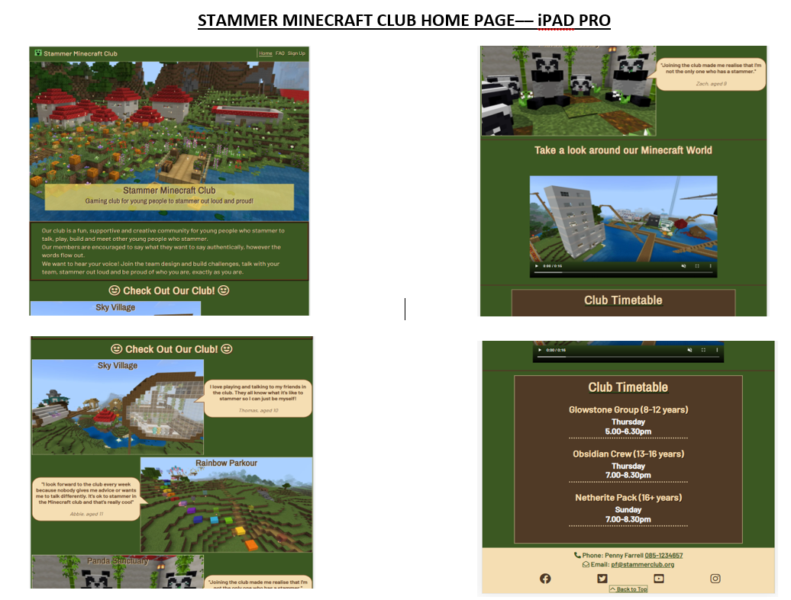

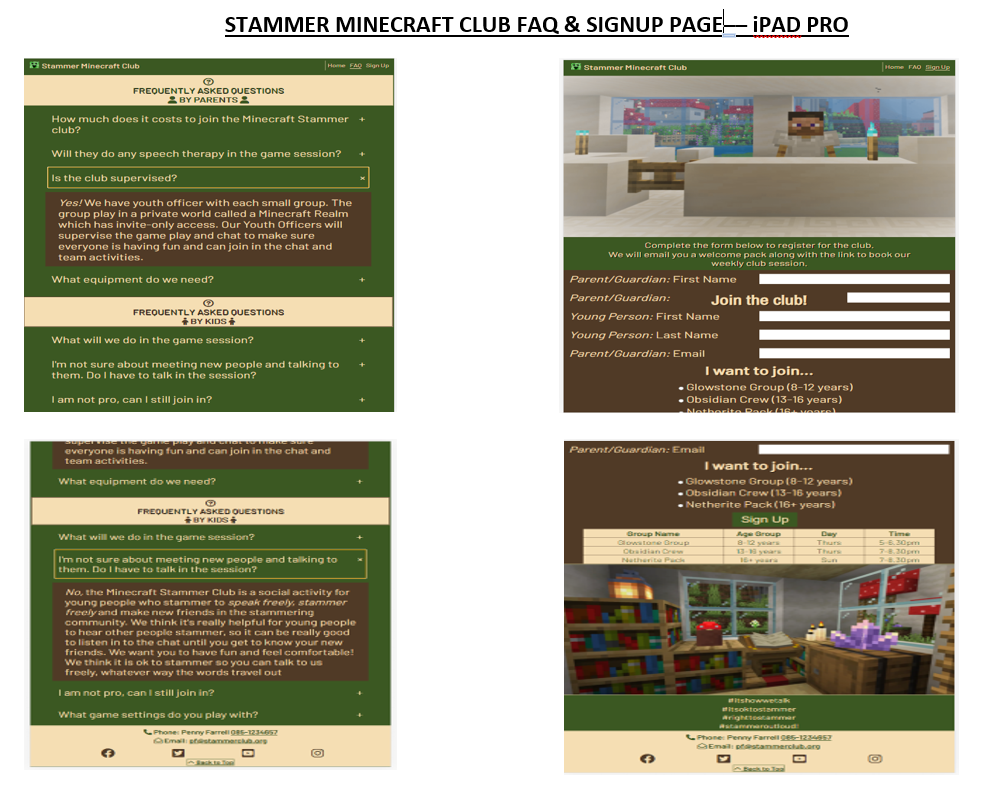

## WAVE Testing

I used the WAVE testing tool to ensure that there are no accessibility issues with my site. 
[WAVE](http://wave.webaim.org/) (Web Accessibility Evaluation Tool) allows developers to create content that is more accessible to users with disabilities. It does this by identifying accessibility and WGAC errors.

The initial test highlighted contrast errors with the title overlays on the home page testimonial section. 
[WAVE Report - Contrast Error](assets/css/testing-images/WAVE image-text-contrast-error.png)

I fixed this by increasing the contrast of the text background by wrapping a span around the text in HTML and styling the background to a higher contrast with CSS. The report shows this error has been fixed.
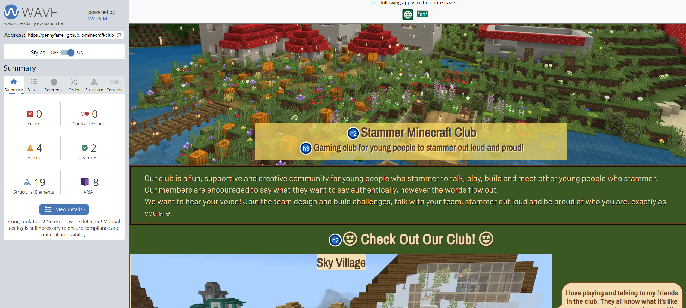

There are 4 alerts in the report. The footer contact have been flagged as potential headings. This is an unordered list and intentional, so I did not change the semantics here.

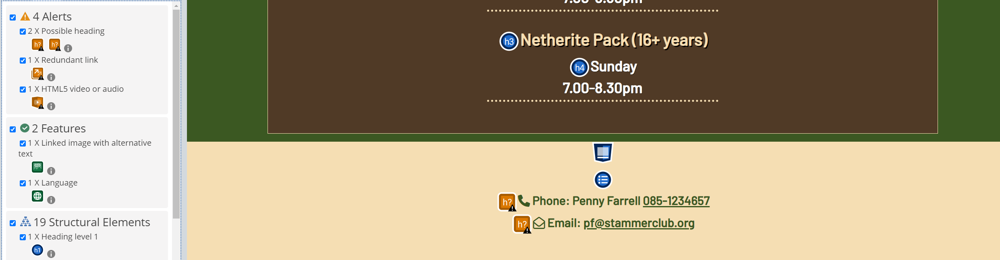

The alert for a redundant link is for the active link to show which page a user is on. As this is an intended feature, this was not changed. 

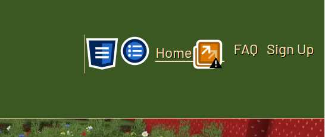

The alert for a HTML5 video relates the embedded video tour. As this is an intentional feature, this was retained.

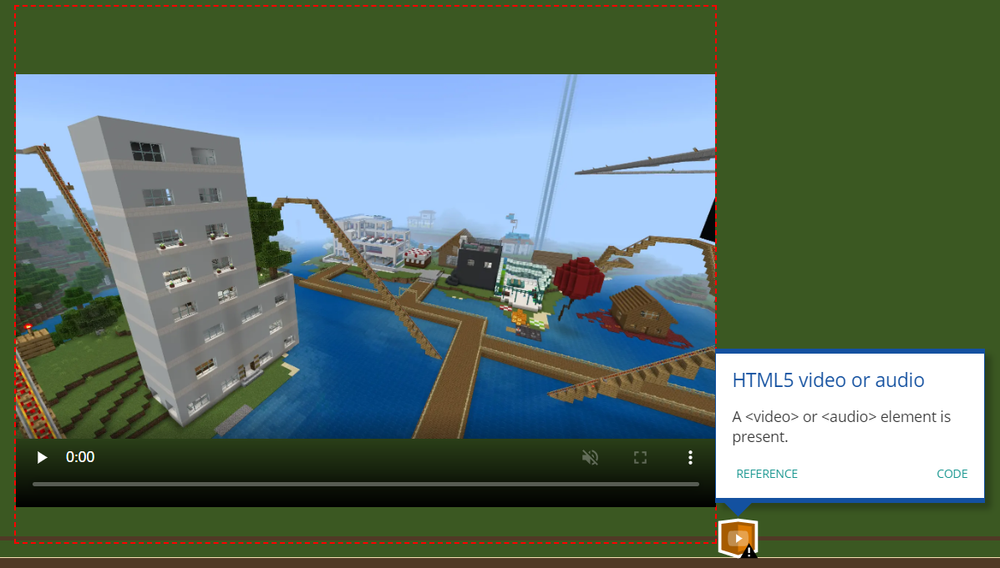

## MANUAL TESTING

### Testing User Stories

| Goals | How are they achieved? |
| :--- | :--- |
| **Visitor (Parent/Guardian)** |
|  |  |
| Understand what the site is for and how to navigate the site. | Site logo and title explains the nature of the club and is included in the header on every page. |
| Understand what the club is about, who it is for and the benefits for their child. | The description on the home page explains the ethos of the club and encourages potential new members to join. The images and testimonials successively build on the positive impressions and benefits of joining the club.|
| Find answers to common questions | Parent/guardians will have different queries to club members so there are two sections for FAQs. Common queries are addressed which also provide information about the club including tech requirements. |
| Complete signup form as call-to-action | Parent/guardians will have different queries to club members so there are two sections for FAQs. Common queries are addressed which also provide information about the club including tech requirements. |
| Find information about timetable | Parent/guardians would use the timetable on the home page to gain information about the ages and schedule of sessions. The timetable is repeated under the signup form to refresh their memory of the schedule without having to return to the home page to seek the information. |
| Easily call or email organiser using links in Footer | Parent/guardians may wish to direct specific queries by contacting the organiser. The links embedded in the Footer enable contact to be made directly from the page without navigating away from the site.  |
| **Visitor (Young Person)** |
|  |  |
| Understand what the site is for and how to navigate the site. | Site logo and title explains the nature of the club and is included in the header on every page. |
| Understand what the club is about, who it is for and what is appealing about the club. | The description on the home page explains the ethos of the club and encourages potential new members to join. The images and testimonials are from existing members (peers) which successively builds on the positive impressions and benefits of joining the club. |
| Feel enthused and motivated to join | The color theme and logo are associated with Minecraft. There are plenty of visuals and a video tour throughout the site which will help young users to know what to expect from joining the club and to feel inspired to join by viewing the creative content that the club has already made. A highly appealing visual appeal was a priority in the deign of this site. |
| Find answers to common questions | Young users/potential club members will have different queries to parents/adults so their questions were collated into a sepcific section. Common queries are addressed which also provide information about the club which aim to reassure, encourage and support members to give the club a try. |
| Find information about the game play and what happens during a session | The video tour on the home page illustrates the game play and the voice over is a young person who stammers, which is encouraging to potential new members as they hear stammering and know that stammering is ok and the club is  safe, encouraging place to stammer in. |
| **Visitor (Other e.g. Teacher)** |
|  |  |
| Understand how to navigate the site | The logo, title and nav bar shows a new user the content available across the site. |
| Understand the purpose and target audience for the club | The description, testimonials, timetable and FAQs provide all the relevant information and this is arranged logically in the way a user expects information to be provided. |
| Access information about the club including a timetable and target age groups | Clear access to information through styled sections and the nav bar helps users to navigate the site and the content they need. |

## Fixed Bugs

When validating the code, a few errors came up. these have been fixed. This is a summary of the main errors and steps taken to fix it: 
  
| Bug | Section | Fix |
| :----| :----| :--------:|
|Header element logo and nav bar alignment | Home page |I had help from tutor as i had difficulty aligning the logo/title to the left with the nav bar menu to the right. Adding another div and using Flex solved this. The alignment is now correct and the menu adapts from column for small screens to a row for larger screens. |
| Overuse of margin and padding to align content| Sign Up page | There was a thick bar to the right side of the signup page on screen sizes from large mobile and upwards. Unicorn revealer showed that it was from the body margin. This had been accidentally changed to counteract the alignment of the signup images, form and timetable. The body margin was reverted and the content was aligned using 
 and Flexbox styling. |
| HTML validator error "The value of the for attribute of the label element must be the ID of a non-hidden form control"  | Sign Up page  | I corrected the "ID" tags and made they were the same as the "name" tags. |
| Images correct size but zoomed in to wrong area of image | All pages | I researched the styling options for images and used image-position: center to make sure the image was focused on the central area which showed the content I wanted to be most visible. |
| I used h2 and then h4 without using h3 | Sign Up Page | I changed the h4 to h3 and this improved accessibility and semantic profile pf the page HTML. |
| No video showed when site was first deployed | Home Page | I changed the file path and created a relative filepath which solved the error. |
| Footer overflow when adding back-to-top button | All pages | A max-height command was added which fixed this error.|
| Signup image title position | Signup page | The title overlaying the hero image of the signup page was styled to be responsive in size and position, however the CSS settings that worked for specific numerical breakpoints (320px, 475px, 768px, 1024px, 1440px) did not work as expected when testing on device-specific sizes (iPhone 5/Samsung tablet). The absolute position caused the title to be located in the incorrect place. After several attempts to adjust the position settings, the title was altered to be a separate h2 title above the image. This was not the intended style but it was more reliable and consistently responsive.|

## Unfixed Bugs

There are no known bugs in the project.

## Additional Testing

### Lighthouse
The application was also tested using [Google Lighthouse](https://developers.google.com/web/tools/lighthouse) in Chrome Developer Tools. The following aspects were tested:

* Performance - reveals how the site performs during loading
* Accessibility - shows if the site if accessible for all users and suggests ways to improve it
* Best Practices - indicates if the site conforms to industry best practices
* SEO - Search Engine Optimisation - shows if the site is optimised for search engine result rankings

### Results from Lighthouse 

* Home Page

  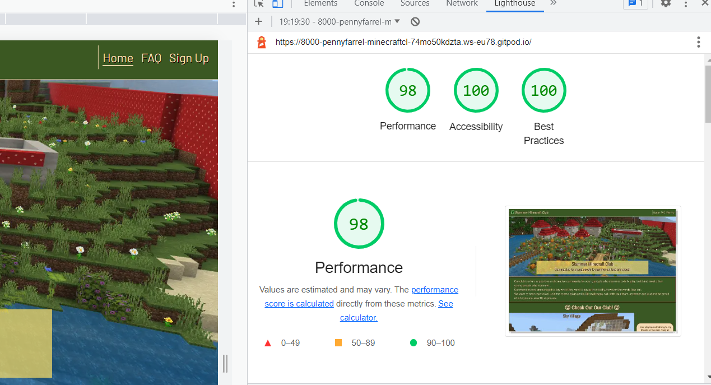 

* FAQ Page

  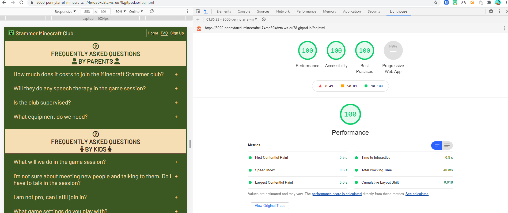

* Sign Up Page

  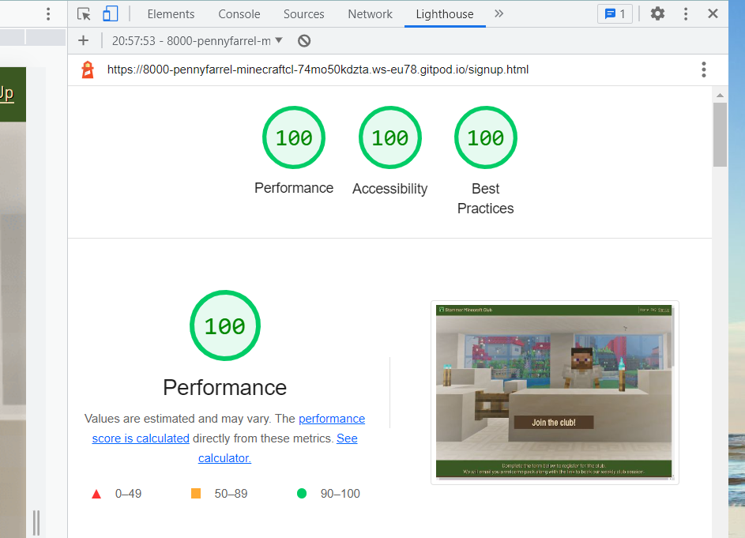

* Originally, my home page result was poor on performance. I compressed the images and changed the video preload to "none" which improved the performance. For accessibility, I fixed the input aria-labels in the sign-up form which increased the score substantially.

## Feature Testing

| Feature | Expected Outcome | Testing Performed | Result | Pass/Fail |
| --- | --- | --- | --- | --- |
| **Navbar** |
|  |  |  |  |  |
| Stammer Minecraft Club Logo & Title | When Logo is clicked, the user will be redirected to the home page. | Clicked Logo and title | Redirected to the home page. | Pass |
| Home Page Link | When clicked the user will be redirected to the home page.| Clicked link | Redirected to the home page. | Pass |
| FAQ Link | When clicked the user will be redirected to the FAQ page. | Clicked link | Redirected to the FAQ page. | Pass |
| Signup Link | When clicked the user will be redirected to the Signup page. | Clicked link | Redirected to the Signup page. | Pass |
| **Footer** |
|  |  |  |  |  |
| Social Media Links| When a social media icon is clicked, a new tab will open for the corresponding social media page. | Clicked link | New tab opens and redirects to the corresponding social media page for each of the social media icons | Pass |
| Telephone and Email Links | When the icon or contact information is clicked, the user will be redirected to make a call or send an email to the organiser. | Clicked Telephone and Email icons | Telephone opens a op-up window with the correct phone number in it. Email opens up a new window with an email addressed to the organiser. | Pass |
| **Home Page - Video** |
|  |  |  |  |  |
| Video | When clicked the video will play with sound on mute and visible controls to pause/play/turn on volume. | Clicked link | When clicked the video will play with sound on 
mute and visible controls to pause/play/turn on volume. | Pass |
| **FAQ Page** |
|   |   |   |   |
| Accordion buttons on FAQ section | When the "+" symbol is clicked, the corresponding answer appears below. The answer has a different background color to visually contrast the question and answer. | Clicked each "+" button in FAQ section  | Each answer is revealed and each answer is correctly color-coded. | Pass |
| Accordion buttons on FAQ section | When the "-" symbol is clicked, the revealed answer disappears and the next question scrolls back into view. | Clicked each "-" button in FAQ section  |  The revealed answer disappeared and the next question scrolled back into view. | Pass ||
| **Sign Up Page** |
| Username of adult/child input - empty | This is a required field so the form should not submit if empty | Tried to submit the form with this field empty | Tooltip tells me this field is required | Pass |
| Email input empty | This is a required field so the form should not submit if empty | Tried to submit the form with this field empty | Tooltip tells me this field is required |  Pass |
| Submit button | When the signup (submit) button is clicked, the user is redirected to a success submission page to confirm that their submission was successfully processed.| Submitted form | Redirected to the Code Institute 'submission successful' page. | Pass |
