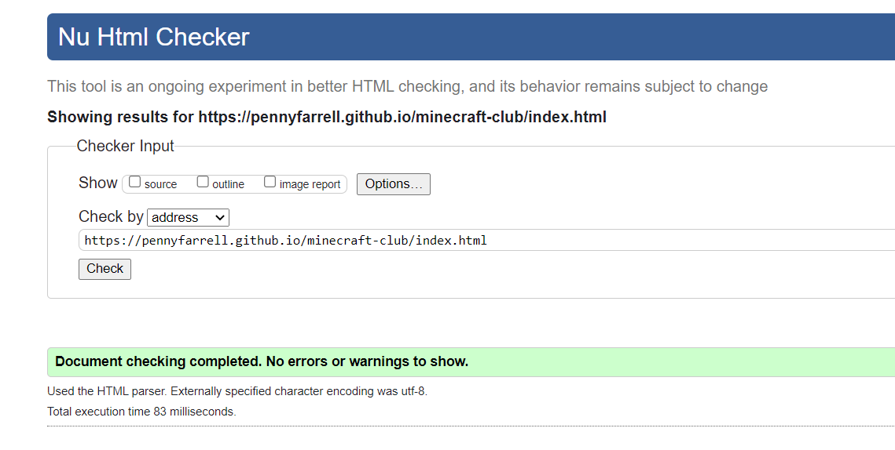
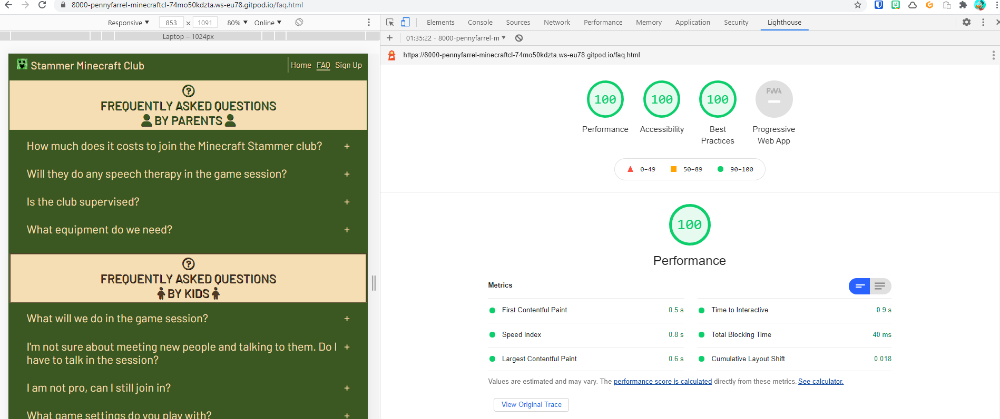
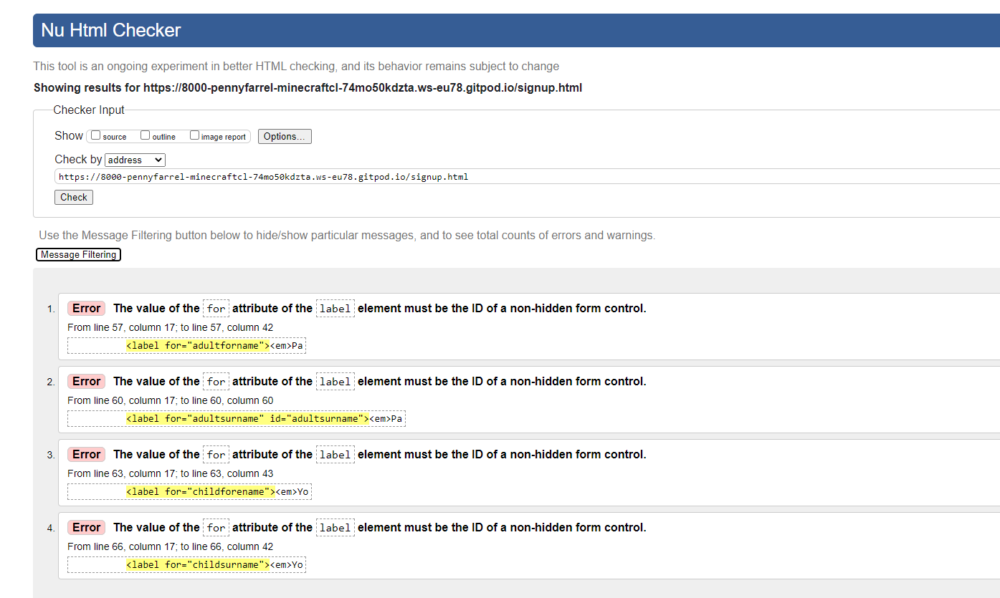
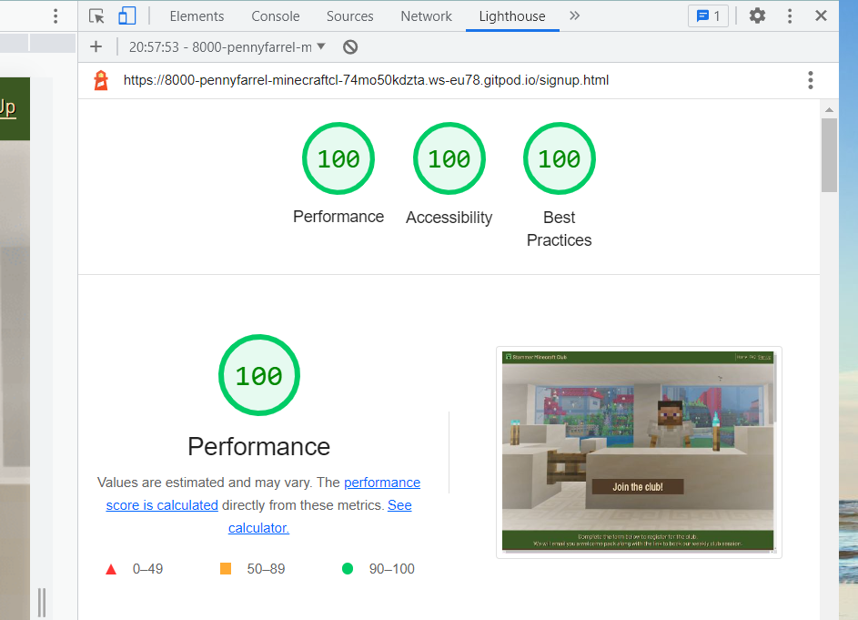

# Testing

## Code Validation

The [Stammer Minecraft Club](https://pennyfarrell.github.io/minecraft-club/) webpage was thouroughly tested. HTML code was reviewed in the [W3C HTML Validator](https://validator.w3.org). The CSS code was validated in the [W3C CSS Validator](https://jigsaw.w3.org/css-validator/). There were a few minor errors found regarding incorrect semantic use of header tags, missing closing double quote in attribute and incorrect input labels. All mistakes were corrected and both HTML and CSS files currently have no errors.

The results of HTML validation of each of the pages are as follows:

* Home Page

  

* FAQ Page

  

* Sign Up Page
  

The CSS Validator results are below:

## Browser Compatibility

The website was tested on the following browsers: Google Chrome, Safari, Microsoft Edge and Mozilla Firefox. There were no errors discovered in the functionality of the site or the individual features.

## Responsiveness Test

Testing of responsive design was carried out manually by utilizing [Google Chrome DevTools](https://developer.chrome.com/docs/devtools) and [Responsive Design Checker](https://www.responsivedesignchecker.com/).

|        | S Galaxy 5 | iPhone 6/6S/7| iPhone 5 | iPad Mini | iPad Pro | Display <1200px | Display >1200px |
|--------|------------|--------------|----------|-----------|----------|-----------------|-----------------|
| Render | pass       | pass         | pass     | pass      | pass     | pass            | pass            |
| Images | pass       | pass         | pass     | pass      | pass     | pass            | pass            |
| Links  | pass       | pass         | pass     | pass      | pass     | pass            | pass            |

## Fixed Bugs

When validating the code, a few errors came up especially 
  
| Bug | Section | Fix |
| :----| :----| :--------:|
|Header element logo and nav bar alignment | Home page |I had help from tutor as i had difficulty aligning the logo/title to the left with the nav bar menu to the right. Adding another div and using Flex solved this. The alignment is now correct and the menu adapts from column for small screens to a row for larger screens. |
| Overuse of margin and padding to align content| Sign Up page | There was a thick bar to the right side of the signup page on screen sizes from large mobile and upwards. Unicorn revealer showed that it was from the body margin. This had been accidentally changed to counteract the alignment of the signup images, form and timetable. The body margin was reverted and the content was aligned using 
 and Flexbox styling. |
| HTML validator error "The value of the for attribute of the label element must be the ID of a non-hidden form control"  | Sign Up page  | I corrected the "ID" tags and made they were the same as the "name" tags. |
| Images correct size but zoomed in to wrong area of image | All pages | I researched the styling options for images and used image-position: center to make sure the image was focused on the central area which showed the content I wanted to be most visible. |
| I used h2 and then h4 without using h3 | Sign Up Page | I changed the h4 to h3 and this improved accessibility and semantic profile pf the page HTML. |
| No video showed when site was first deployed | Home Page | I changed the file path and created a relative filepath which solved the error. |
| Footer overflow when adding back-to-top button | All pages | A max-height command was added which fixed this error.

## Unfixed Bugs

There are no known bugs in the project.

## Additional Testing

### Lighthouse
The application was also tested using [Google Lighthouse](https://developers.google.com/web/tools/lighthouse) in Chrome Developer Tools. The following aspects were tested:

* Performance - reveals how the site performs during loading
* Accessibility - shows if the site if accessible for all users and suggests ways to improve it
* Best Practices - indicates if the site conforms to industry best practices
* SEO - Search Engine Optimisation - shows if the site is optimised for search engine result rankings

### Results from Lighthouse 

* Home Page

   

* FAQ Page

  

* Sign Up Page

  

* Originally, my site results were poor on performance and on accessibility. I compressed all images using [the Squoosh app](https://squoosh.app/) and it improved the peformance significantly. As for accessibility, I added extra aria-labels especially for the form which increased the score substantialy.